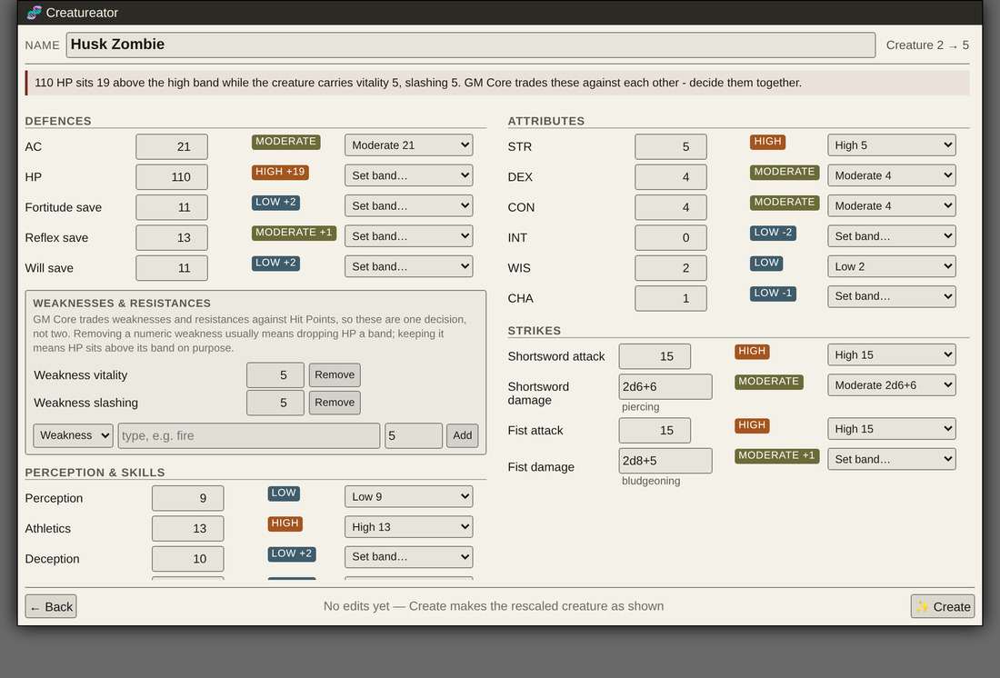
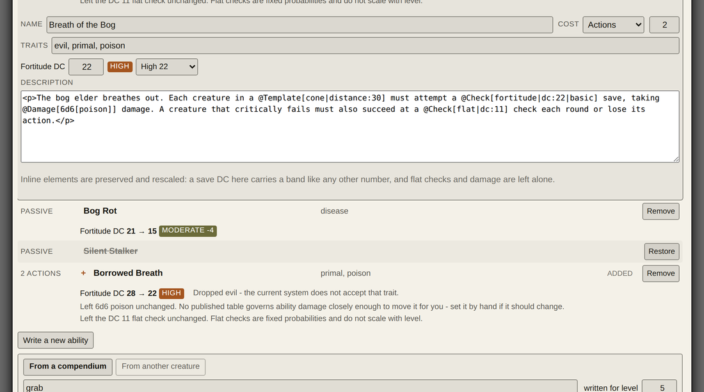

# Creatureator

A Foundry VTT module for building custom Pathfinder 2e creatures.

Take a creature from your bestiary as a chassis, rescale it to any level against the
GM Core *Building Creatures* tables, edit every number with its band shown, and graft
on abilities from your compendia or from any other creature. The result is a real PF2e
NPC actor — indistinguishable from a hand-built one, and compatible with everything
else in your world.

> **Status: 0.1.0, pre-alpha, and useful.** The full path works end to end: pick a
> chassis, rescale, edit, attach abilities, create. Released and installable — but
> not yet used by anyone except its authors. Read
> [ROADMAP.md](./ROADMAP.md) before relying on it.



## What it does today

- **Pick a chassis** from every Actor compendium you have — 6,393 creatures on a
  typical install — with provenance shown, because rescaling someone's homebrew
  carries different assumptions than rescaling a Monster Core creature.
- **Rescale to any level** from -1 to 24 against the published tables. Every
  statistic, every Strike, spellcasting DCs and attack modifiers, and the save DCs
  written inside the creature's own ability text.
- **Edit anything**, with the band re-derived as you type and a one-click override per
  statistic. Hit Points and weaknesses are presented as the single decision GM Core
  says they are.
- **Attach abilities** from about 1,400 shared compendium items, or from any other
  creature in your bestiary — where the source level is known, so the save DCs are
  rescaled exactly rather than guessed at.
- **Write abilities from scratch**, or reflavour any ability: name, action cost,
  traits, description, and the DCs inside the text.
- **Create the actor** only when you say so. Nothing is written to your world before
  that.



## Requirements

- Foundry VTT **v14+** (verified 14.366)
- Pathfinder 2e system **8.2.0+** (verified 8.4.0)

## Install

In Foundry: **Add-on Modules → Install Module → Manifest URL**

```
https://github.com/kenshohtp/creatureator/releases/latest/download/module.json
```

## Design principles

**No adjustment is ever silent.** Every derived number carries its band and any
deliberate offset. When the engine leaves something alone — a flat check, a damage
expression, a DC it cannot resolve — it says which, and why. A warning that fires and
then clears when you address it is worth more than a warning that is always on.

**Deterministic first.** All scaling is table lookup against published Paizo numbers,
validated against every creature in the Archives of Nethys index — 4,743 of them at
the last run, with exact agreement on Perception, all three saves, Wisdom and Hit
Points. There is no language model anywhere in the path that decides a statistic, and
the module is fully useful without an API key.

**Measured, not assumed.** Where the rules are ambiguous, the bestiary is the oracle.
The classifier, the table that governs ability DCs, and the decision to leave ability
damage alone were each settled by measuring thousands of published creatures rather
than by reasoning about what Paizo probably meant. Details and figures live in
[ARCHITECTURE.md](./ARCHITECTURE.md).

**Offsets survive.** A creature sitting one point above High stays one point above
High after rescaling, rather than being snapped to the nearest table row.

## Roadmap and open items

Both live in **[ROADMAP.md](./ROADMAP.md)** — what is next, what is a known issue,
what was investigated and deliberately closed, and how to verify each one.

It is kept in one place on purpose. This README used to carry its own roadmap and its
own open-items table, and both had drifted: they still listed a released module as
unreleased, and an investigation as pending after it had concluded. Parallel copies of
a list are a reliable way to end up with a wrong one.

## Development

```bash
npm install
npm run check          # typecheck, test, build — stops at the first failure
npm run build          # emits scripts/ (gitignored)
npm run fetch:tables   # regenerate src/data/creature-tables.ts from AoN
npm run fetch:corpus   # harvest the validation fixture from AoN (optional, ~5MB)
npm run package        # build module.zip for a release
```

`fetch:tables` output is committed, so a fresh clone builds without network access.
Re-run it only when Paizo publish errata.

Foundry loads the module from a symlink to this repository, so `npm run build`
followed by F5 in the browser is the whole edit-test loop. A server restart is only
needed when adding a new module.

### Probes

`tools/` holds the measurement scripts, in two kinds. `probe-*.js` are pasted into the
Foundry console and read your world without writing to it. `read-pack.mjs` and
`probe-strike-shapes.mjs` run from the command line and read Foundry's compendium
packs straight off disk, with Foundry closed — the whole PF2e system parses in about
three seconds.

They exist because every part of this module built from assumption was wrong, and
every part built from a probe held up. Write more of them.

## Data sources

Creature chassis and abilities come from the PF2e system's own compendia. Copying a
compendium actor preserves its Strike items, rule elements and automation, which
parsing a text stat block cannot — so the module never parses a stat block.

Archives of Nethys is used offline to generate the tables and the validation corpus.

## Licence

Module code: MIT (see [LICENSE](./LICENSE)).

Pathfinder game mechanics reproduced in `src/data/` are Open Game Content published
under the ORC License. Both required notices — the ORC Notice and the Attribution
Notice — are in [NOTICE.md](./NOTICE.md), copied verbatim from Pathfinder GM Core's
own legal page.

**What is redistributed and what is merely used are different things.** This
repository and the release archive carry the mechanical tables and nothing else
Paizo-owned; that is enforced by an allowlist in `tools/package-module.mjs` rather
than by remembering. What the module *does* at runtime is copy content out of the
compendia you have installed — Paizo premium modules you have bought very much
included — into the creature it builds. That is the point of it: a cloned chassis
keeps its Strikes, rule elements, description and art, and a grafted ability keeps
its text verbatim until you reflavour it. Nothing is uploaded or bundled anywhere,
and the creature lives in your own world.
